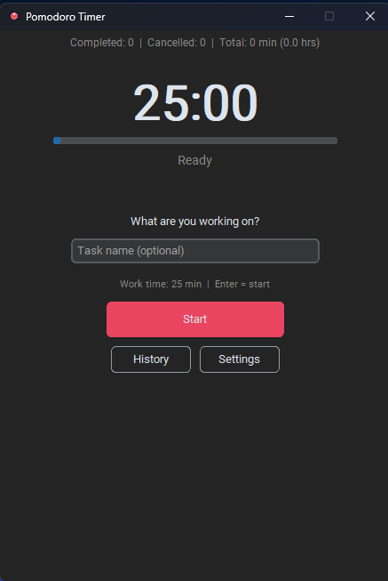
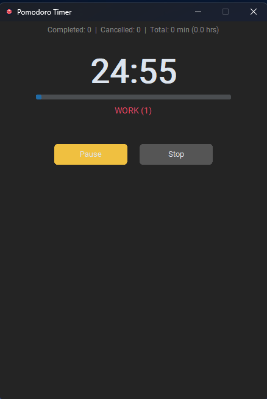
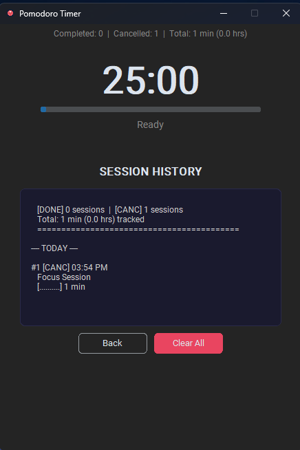

# Pomodoro Timer

A minimalist, dark-themed Pomodoro timer built with Python and CustomTkinter. Track your focus sessions, manage breaks, and view your productivity history.

## Features

- **Pomodoro Timer** — 25-minute work sessions with short/long breaks
- **Customizable** — Set your own work and break durations
- **Session History** — View completed and cancelled sessions with dates
- **Task Labels** — Name each session to track what you worked on
- **Progress Bar** — Visual countdown during sessions
- **Pause & Resume** — Pause anytime without losing progress
- **Persistent Settings** — Your preferences are saved automatically
- **Clear History** — Reset your session log anytime
- **Dark Theme** — Easy on the eyes for long work sessions

## Screenshots





## Installation

### Option 1: Run the EXE (No Python needed)

1. Download `Pomodoro.exe` from the [Releases](https://github.com/yourusername/pomodoro-timer/releases) page
2. Double-click to run
3. That's it!

### Option 2: Run from source

```bash
git clone https://github.com/yourusername/pomodoro-timer.git
cd pomodoro-timer
pip install customtkinter
python pomodoro.py
